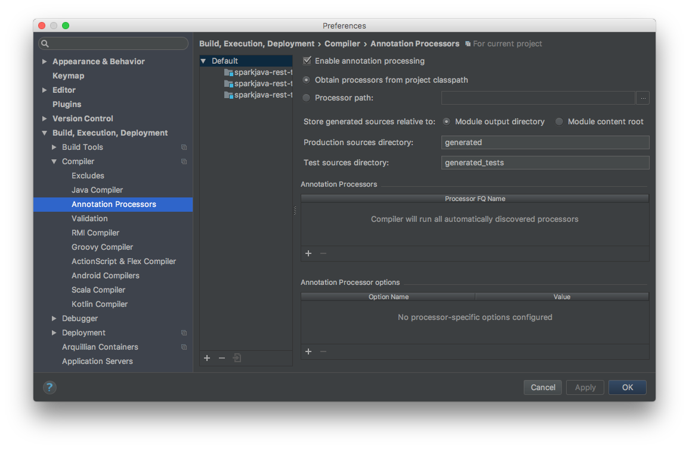

# Kotlin Spring Boot REST Template

[](https://travis-ci.org/michalkowol/kotlin-spring-boot-template)
[](https://codecov.io/github/michalkowol/kotlin-spring-boot-template?branch=master)

## Architecture

### Package By Feature

Package-by-feature uses packages to reflect the feature set. It tries to place all items related to a single feature (and only that feature) into a single directory/package. This results in packages with high cohesion and high modularity, and with minimal coupling between packages. Items that work closely together are placed next to each other. They aren't spread out all over the application. It's also interesting to note that, in some cases, deleting a feature can reduce to a single operation - deleting a directory. (Deletion operations might be thought of as a good test for maximum modularity: an item has maximum modularity only if it can be deleted in a single operation.)

Source: http://www.javapractices.com/topic/TopicAction.do?Id=205

### HTTP

Thread HTTP only as your transporting layer. Try to avoid leaking HTTP logic into your briskness logic. Utilize **domain-driven design**.


## Build

### Default

```bash
gradle
```

### Build

```bash
gradle build
```

### Run

```bash
gradle run
```

### Tests

```bash
gradle check
```

### Continuous tests

```bash
gradle test -t
```

or

```bash
gradle test --continuous
```

### Integration tests
    
```bash
gradle integrationTest
```

### One-Jar

```bash
gradle assemble

java -jar build/libs/{NAME}-assembly-${VERSION}.jar

java -Dspring.profiles.active=dev -jar build/libs/{NAME}-assembly-${VERSION}.jar
java -Dspring.profiles.active=qa -jar build/libs/{NAME}-assembly-${VERSION}.jar
java -Dspring.profiles.active=staging -jar build/libs/{NAME}-assembly-${VERSION}.jar
java -Dspring.profiles.active=production -jar build/libs/{NAME}-assembly-${VERSION}.jar

java -Denvironment=dev -jar build/libs/{NAME}-assembly-${VERSION}.jar
java -Denvironment=qa -jar build/libs/{NAME}-assembly-${VERSION}.jar
java -Denvironment=staging -jar build/libs/{NAME}-assembly-${VERSION}.jar
java -Denvironment=production -jar build/libs/{NAME}-assembly-${VERSION}.jar
```

### Code coverage

```bash
gradle jacocoTestReport
open build/reports/jacoco/test/html/index.html
```

## PostgreSQL

### Docker

```bash
docker run --name softwareberg-postgres-db -p 5432:5432 -e POSTGRES_DB=softwareberg -e POSTGRES_USER=softwareberg -e POSTGRES_PASSWORD=softwareberg -d postgres:9.6
```

### Library

`build.gradle`:

```groovy
// ...
dependencies {
    // ...
    compile 'org.postgresql:postgresql:9.4.+'
    // ...
}
// ...
```

### Configuration

`application.properties`:

```properties
# ...
datasource.jdbcUrl=jdbc:postgresql://localhost:5432/softwareberg
datasource.username=softwareberg
datasource.password=softwareberg
# ...
```

## Heroku

### Test on local

```bash
heroku local web
```

### Deploy

```bash
heroku login
heroku create
git push heroku master
heroku logs -t
```

or

```bash
heroku git:remote -a NAME_OF_APP
git push heroku master
heroku logs -t
```

https://spring-boot-kotlin-template.herokuapp.com/

## IntelliJ

Remember to turn on "Annotation Processors"



## Random

```kotlin
package pl.michalkowol.repository.simple

import org.springframework.stereotype.Repository

/*
| Annotation | Meaning                                             |
+------------+-----------------------------------------------------+
| @Component | generic stereotype for any Spring-managed component |
| @Repository| stereotype for persistence layer                    |
| @Service   | stereotype for service layer                        |
| @Controller| stereotype for presentation layer (spring-mvc)      |
 */

data class Address(val street: String, val city: String)
data class Person(val name: String, val addresses: List<Address>)

@Repository
open class SimplePeopleRepository {
    /*
    Why does it have `open` modifier?
    Unable to proxy method [public final java.util.List pl.michalkowol.repository.simple.SimplePeopleRepository.findByName(java.lang.String)]
    because it is final: All calls to this method via a proxy will NOT be routed to the target instance.
     */
    open fun findOne(id: Long): Person? {
        if (id == 1L) {
            return Person("Michal", listOf(Address("Chemiczna", "Gliwice"), Address("Pulawska", "Warszawa")))
        } else if (id == 2L) {
            return Person("Kasia", listOf(Address("Przybylskiego", "Warszawa")))
        }
        return null
    }

    open fun findAll(): List<Person> {
        val people = listOf(findOne(1), findOne(2)).filterNotNull()
        return people
    }

    open fun findByName(name: String): List<Person> {
        val people = listOf(findOne(1), findOne(2)).filterNotNull()
        return people.filter { it.name == name }
    }
}
```

## Links

* [41. Testing](https://docs.spring.io/spring-boot/docs/current/reference/html/boot-features-testing.html)
* [Testing improvements in Spring Boot 1.4](https://spring.io/blog/2016/04/15/testing-improvements-in-spring-boot-1-4)
* [404 Not Found](http://docs.spring.io/spring-boot/docs/current/api/org/springframework/boot/test/SpringApplicationConfiguration.html)
* [Maven Repository: org.springframework » spring-context](https://mvnrepository.com/artifact/org.springframework/spring-context)
* [41. Testing](https://docs.spring.io/spring-boot/docs/current/reference/html/boot-features-testing.html)
* [Getting Started · Managing Transactions](https://spring.io/guides/gs/managing-transactions/)
* [unit testing - How to test Spring Data repositories? - Stack Overflow](http://stackoverflow.com/questions/23435937/how-to-test-spring-data-repositories)
* [Testing improvements in Spring Boot 1.4](https://spring.io/blog/2016/04/15/testing-improvements-in-spring-boot-1-4)
* [404 Not Found](http://docs.spring.io/spring-boot/docs/current/api/org/springframework/boot/test/SpringApplicationConfiguration.html)
* [Maven Repository: org.springframework » spring-context](https://mvnrepository.com/artifact/org.springframework/spring-context)
* [41. Testing](https://docs.spring.io/spring-boot/docs/current/reference/html/boot-features-testing.html)
* [SpringRunner - Google Search](https://www.google.pl/search?q=SpringRunner&oq=SpringRunner&aqs=chrome..69i57j0l5.375j0j1&sourceid=chrome&ie=UTF-8)
* [Structuring a complex schema — Understanding JSON Schema 1.0 documentation](https://spacetelescope.github.io/understanding-json-schema/structuring.html#reuse)
* [Spring Boot](https://projects.spring.io/spring-boot/)
* [73. Embedded servlet containers](https://docs.spring.io/spring-boot/docs/current/reference/html/howto-embedded-servlet-containers.html)
* [Getting Started · Building an Application with Spring Boot](https://spring.io/guides/gs/spring-boot/)
* [Maven Repository: org.postgresql](https://mvnrepository.com/artifact/org.postgresql)
* [localhost:8080/people](http://localhost:8080/people)
* [18. Using the @SpringBootApplication annotation](http://docs.spring.io/autorepo/docs/spring-boot/current/reference/html/using-boot-using-springbootapplication-annotation.html)
* [localhost:8080/people](http://localhost:8080/people)
* [kotlin-spring-boot-template/build.gradle at master · michalkowol/kotlin-spring-boot-template](https://github.com/michalkowol/kotlin-spring-boot-template/blob/master/build.gradle)
* [Spring Data JPA - Reference Documentation](https://docs.spring.io/spring-data/jpa/docs/current/reference/html/)
* [localhost](http://localhost:8080/people/1)
* [OneToOne (Java EE 6 )](http://docs.oracle.com/javaee/6/api/index.html?javax/persistence/ManyToMany.html)
* [localhost:8080/cities](http://localhost:8080/cities)
* [localhost:8080/people](http://localhost:8080/people)
* [localhost:8080/cities](http://localhost:8080/cities)
* [JPA implementation patterns: Using UUIDs as primary keys | Xebia Blog](http://blog.xebia.com/jpa-implementation-patterns-using-uuids-as-primary-keys/)
* [kotlin-spring-boot-template/model.kt at master · michalkowol/kotlin-spring-boot-template](https://github.com/michalkowol/kotlin-spring-boot-template/blob/master/src/main/kotlin/pl/michalkowol/model/jpa/model.kt)
* [Chapter 5. Basic O/R Mapping](http://docs.jboss.org/hibernate/core/3.6/reference/en-US/html/mapping.html#d0e5294)
* [java - Using Hibernate UUIDGenerator via annotations - Stack Overflow](http://stackoverflow.com/questions/6356834/using-hibernate-uuidgenerator-via-annotations)
* [How to generate UUIDs as primary keys with Hibernate](http://www.thoughts-on-java.org/generate-uuids-primary-keys-hibernate/)
* [java - How to create and handle composite primary key in JPA - Stack Overflow](http://stackoverflow.com/questions/13032948/how-to-create-and-handle-composite-primary-key-in-jpa)
* [EmbeddedId (Java EE 6 )](https://docs.oracle.com/javaee/6/api/javax/persistence/EmbeddedId.html)
* [localhost:8080/people](http://localhost:8080/people)
* [kotlin-spring-boot-template/model.kt at master · michalkowol/kotlin-spring-boot-template](https://github.com/michalkowol/kotlin-spring-boot-template/blob/master/src/main/kotlin/pl/michalkowol/cities/model.kt)
* [Connecting to Relational Databases on Heroku with Java | Heroku Dev Center](https://devcenter.heroku.com/articles/connecting-to-relational-databases-on-heroku-with-java#using-the-spring_datasource_url-in-a-spring-boot-app)
* [Connecting to Relational Databases on Heroku with Java | Heroku Dev Center](https://devcenter.heroku.com/articles/connecting-to-relational-databases-on-heroku-with-java#using-the-spring_datasource_url-in-a-spring-boot-app)
* [24. Externalized Configuration](http://docs.spring.io/spring-boot/docs/current/reference/html/boot-features-external-config.html)
* [java - Set default properties in a library with spring-boot - Stack Overflow](http://stackoverflow.com/questions/28892948/set-default-properties-in-a-library-with-spring-boot)
* [java - Is there a way to specify a default property value in Spring XML? - Stack Overflow](http://stackoverflow.com/questions/2513484/is-there-a-way-to-specify-a-default-property-value-in-spring-xml)
* [72. Properties & configuration](https://docs.spring.io/spring-boot/docs/current/reference/html/howto-properties-and-configuration.html)
* [localhost:8080/people](http://localhost:8080/people)
* [spring-boot-kotlin-template · Heroku-git | Heroku](https://dashboard.heroku.com/apps/spring-boot-kotlin-template/deploy/heroku-git)
* [https://spring-boot-kotlin-template.herokuapp.com/people](https://spring-boot-kotlin-template.herokuapp.com/people)
* [https://spring-boot-kotlin-template.herokuapp.com/people/b04b8e54-53df-4558-b18b-8de44e9fc3c1](https://spring-boot-kotlin-template.herokuapp.com/people/b04b8e54-53df-4558-b18b-8de44e9fc3c1)
* [java - Rest Controller not recognizing GET request in Spring Boot App - Stack Overflow](http://stackoverflow.com/questions/37011790/rest-controller-not-recognizing-get-request-in-spring-boot-app)
* [michalkowol/kotlin-spring-boot-template](https://github.com/michalkowol/kotlin-spring-boot-template)
* [Michał Kowol - Profile - Travis CI](https://travis-ci.org/profile/michalkowol)
* [michalkowol/kotlin-spring-boot-template](https://github.com/michalkowol/kotlin-spring-boot-template)

## References

* [Spring Boot](http://projects.spring.io/spring-boot/)
* [Use Jetty instead of Tomcat](http://docs.spring.io/spring-boot/docs/current/reference/html/howto-embedded-servlet-containers.html#howto-use-jetty-instead-of-tomcat)
* [AssertionFailure: Fail to process type argument in a generic declaration](https://hibernate.atlassian.net/browse/HHH-9403)
* [Covariant types in Kotlin translated to wildcard types in Java](https://youtrack.jetbrains.com/issue/KT-5792)
* [Kotlin with JPA: default constructor hell](http://stackoverflow.com/questions/32038177/kotlin-with-jpa-default-constructor-hell)
* [CrudRepository](http://docs.spring.io/spring-data/data-commons/docs/1.6.1.RELEASE/reference/html/repositories.html)

## References

* [Spring Boot](http://projects.spring.io/spring-boot/)
* [Use Jetty instead of Tomcat](http://docs.spring.io/spring-boot/docs/current/reference/html/howto-embedded-servlet-containers.html#howto-use-jetty-instead-of-tomcat)
* [CrudRepository](http://docs.spring.io/spring-data/data-commons/docs/1.6.1.RELEASE/reference/html/repositories.html)
* [Jackson Mappers Wrapper (Karol Król)](https://github.com/kjkrol/jackson-mappers-wrapper)
